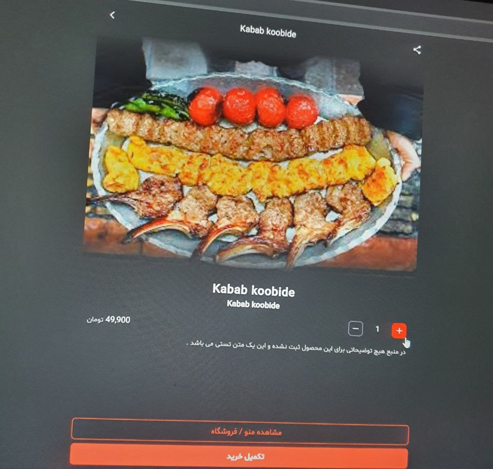

# پروزه تستی رستوران 
> توجه در حال حاضر سروری که api این پروژه با آن ارتباط برقرار میکرد از دسترس خارج شده اما همچنان کد ها در دسترس هستن و 
> عکس هایی از این پروژه موجود است, در این مسیر  : [پوشه عکس ها](https://github.com/elyas-32/Ino-server-project/tree/master/src/assets/images) 
### درباره این پروژه : 
> هدف از این پروژ پیاده سازی یک پروژه رستوران بود که اطلاعات را از api دریافت میکرد
> و قابلیت کنترل سبد خرید کاربر را داشت

#### استفاده شده در این پروژ: 
- React
- React-router
- tailwind
## پیش نمایش : 

